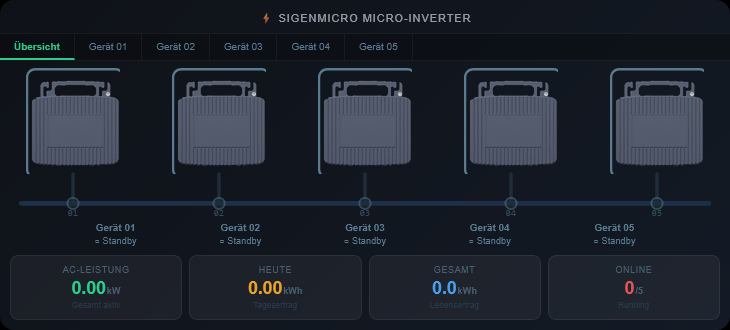
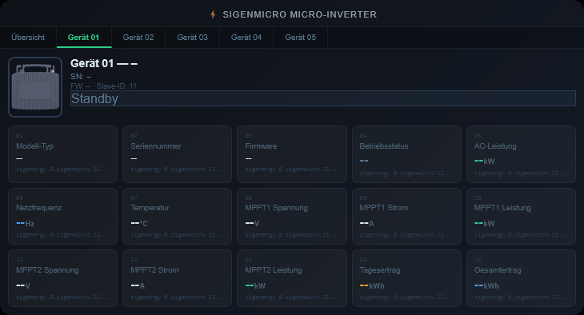

# ioBroker.vis-2-widgets-sigenergy

**Tests:** 

## vis-2-widgets-sigenergy adapter for ioBroker

VIS-2 widget set for the Sigenergy energy storage adapter (`ioBroker.sigenergy`).
Contains 8 widgets for visualisation and control of energy flow, battery status, real-time power, daily statistics, AC charger, DC charger, inverter and SigenMicro micro-inverter overview.

## Requirements

- ioBroker with the `sigenergy` adapter installed and configured
- ioBroker VIS-2 adapter (≥ 2.0.0)

## Widgets

### Energy Flow Diagram
Displays the current energy flow between solar panels, battery, grid and house as an animated SVG diagram.
Animated arrows visualise active connections in real time.

**OIDs:** `pvPower`, `essPower`, `gridActivePower`, `housePower`, `essSoc`

#### Flow directions

| Data point | Value > 0 | Value < 0 |
|---|---|---|
| `essPower` | Battery charging → arrow from centre to battery | Battery discharging → arrow from battery to centre |
| `gridActivePower` | Grid consumption → arrow from grid to centre | Grid feed-in → arrow from centre to grid |
| `pvPower` | PV producing → arrow from PV to centre | — |
| `housePower` | House consuming → arrow from centre to house | — |

### Battery Status & Forecasts
Displays SOC, SOH, charging power and forecasts for time to full charge, remaining runtime, self-consumption and autarky rate.

**OIDs:** `essSoc`, `essSoh`, `essPower`, `batteryTimeToFull`, `batteryTimeRemaining`, `selfConsumptionRate`, `autarkyRate`

### Real-Time Power
Compact list view of all current power values with colour-coded direction indicators.

**OIDs:** `pvPower`, `essPower`, `gridActivePower`, `housePower`, `essSoc`

### Energy Statistics
Daily overview with autarky rate, self-consumption, SOC history, charge/discharge energy and battery coverage.

**OIDs:** `autarkyRate`, `selfConsumptionRate`, `dayMaxSoc`, `dayMinSoc`, `essDailyChargeEnergy`, `essDailyDischargeEnergy`, `batteryCoverageToday`, `batteryDailyChargeTime`

### AC Charger (Sigen EVAC)
Monitoring and control of the Sigenergy AC charger (EVAC). Shows charging power, system state, rated power, rated current and total energy consumed. Alarms are highlighted in colour. The charging current can be set directly via a slider (6–32 A).

**OIDs:** `acCharger.systemState`, `acCharger.chargingPower`, `acCharger.totalEnergyConsumed`, `acCharger.ratedPower`, `acCharger.ratedCurrent`, `acCharger.alarm1/2/3`, `acCharger.control.startStop`, `acCharger.control.outputCurrent`

### DC Charger
Monitoring and control of the Sigenergy DC charger. Shows output power, vehicle SOC with progress bar, vehicle battery voltage, charging current and the energy and duration of the current charging session.

**OIDs:** `dcCharger.outputPower`, `dcCharger.vehicleSoc`, `dcCharger.vehicleBatteryVoltage`, `dcCharger.chargingCurrent`, `dcCharger.currentChargingCapacity`, `dcCharger.currentChargingDuration`, `dcCharger.control.startStop`

### Inverter
Comprehensive monitoring and control of the inverter with tab navigation. Displays operating state, power data, battery temperatures, phase voltages, all 5 alarm registers and device information (model, serial number, firmware).

| Tab | Content |
|---|---|
| **Power** | Active power, PV power, battery charge/discharge power, power share slider (−100 % to +100 %) |
| **Battery** | SOC & SOH with bars, avg. cell temperature/voltage, max./min. temperature |
| **Grid** | Phase voltages L1/L2/L3, grid frequency, power factor, PCS internal temperature |
| **Alarms** | 5 alarm registers (PCS ×2, ESS, gateway, DC charger) with hex code and colour marking |
| **Info** | Model type, serial number, firmware version, Remote-EMS toggle |

**OIDs:** `inverter.activePower`, `inverter.pvPower`, `inverter.essChargeDischargePower`, `inverter.runningState`, `inverter.essBatterySoc/Soh`, `inverter.essAvgCellTemperature/Voltage`, `inverter.phaseA/B/CVoltage`, `inverter.gridFrequency`, `inverter.pcsInternalTemp`, `inverter.alarm1–5`, `inverter.firmwareVersion`, `inverter.modelType`, `inverter.serialNumber`, `inverter.control.startStop`, `inverter.control.remoteEmsDispatchEnable`, `inverter.control.activePowerPercent`

### SigenMicro Overview
Overview and detail view of all SigenMicro micro-inverters connected via Modbus. Tab 1 shows all devices as an animated network segment (Ethernet bus topology with vertical drop lines). Each additional tab shows all 15 registers of the respective device in ascending order.

| Tab | Content |
|---|---|
| **Overview** | All devices as animated bus topology, aggregate tiles (total power, daily yield, lifetime yield, online count) |
| **Device 01–20** | Device image top-left (10 px offset), model/serial/firmware/status badge, all 15 registers (01–15) with value, unit and OID path |

#### Network segment animation
The horizontal backbone line and the vertical drop lines show animated dashes that flow along the cables when a device is active (Running). Inactive devices (Standby/Fault) show only the dark base line without animation.

#### Dynamic layout
| Devices | Rows | Image size |
|---|---|---|
| 1–5 | 1 row | 80 × 90 px |
| 6–10 | 1 row | 52 × 60 px |
| 11–15 | 2 rows | 46 × 52 px |
| 16–20 | 2 rows | 40 × 46 px |

#### Widget settings
| Parameter | Type | Default | Description |
|---|---|---|---|
| micro_count | number (1–20) | 3 | Number of micro-inverters to display |
| sig_title | text | SigenMicro Micro-Inverter | Widget title |
| sig_darkmode | checkbox | true | Dark / Light mode |
| oid_micro1 … oid_micro20 | OID | — | Anchor OID per device (e.g. sigenergy.0.sigenmicro.11.outputPower) |

**OIDs (per device, prefix sigenergy.0.sigenmicro.<slaveId>):**
modelType, serialNumber, firmwareVersion, runningState, outputPower, gridFrequency, temperature, mppt1Voltage, mppt1Current, mppt1Power, mppt2Voltage, mppt2Current, mppt2Power, dailyYield, totalYield

## Appearance

All widgets support a **light and dark mode**, switchable via the widget setting `Dark mode`.

## Changelog
### 1.6.3 (2026-03-26)
* (ssbingo) Sync all language READMEs with missing changelog entries (1.5.10–1.6.2)

### 1.6.2 (2026-03-26)
* (ssbingo) Removed integration test — not applicable for mode:none widget adapter (no Node.js main process)

### 1.6.1 (2026-03-26)
* (ssbingo) Removed ESLint/Prettier setup — no Node.js source to lint in a pure widget adapter; removed lint step from workflow

### 1.6.0 (2026-03-26)
* (ssbingo) Test completed

### 1.5.11 (2026-03-26)
* (ssbingo) Workflow: install-command set to npm install (package-lock.json regeneration required after adding @iobroker/eslint-config)

### 1.5.10 (2026-03-26)
* (ssbingo) README.md: LICENSE section moved to end (after CHANGELOG), full MIT licence text

### 1.5.8 (2026-03-18)
* (ssbingo) fixed GitHub-Actions (PR)

### 1.5.7 (2026-03-18)
* (ssbingo) Removed '## Installation' section from all README files (S6014)

### 1.5.6 (2026-03-18)
* (ssbingo) Version bump to 1.5.6; no functional changes

### 1.5.5 (2026-03-18)
* (ssbingo) Version bump: 1.5.4 was already published on npm; no functional changes

### 1.5.4 (2026-03-18)
* (ssbingo) Added npm-token to test-and-release workflow to enable automated npm publishing

### 1.5.3 (2026-03-17)
* (ssbingo) Removed example installation steps from all README files
* (ssbingo) Fixed E1111: cleared native example config (option1/option2) from io-package.json

### 1.5.2 (2026-03-17)
* (ssbingo) Widget screenshots added: SigenMicro Overview (widget-microinverter_01.png, widget-microinverter_02.png)
* (ssbingo) Energy Flow screenshot updated (widget-energiefluss.png)

### 1.5.1 (2026-03-17)
* (ssbingo) Bugfix: Widget 8 code placed correctly inside vis.binds object — all widgets visible again

### 1.5.0 (2026-03-17)
* (ssbingo) Widget 8: SigenMicro Overview with animated Ethernet bus topology (backbone + vertical drop lines)
* (ssbingo) Dynamic layout for 1-20 micro-inverters, 4 size tiers, 1-2 rows
* (ssbingo) Detail tab per device with all 15 Modbus registers (01-15, ascending by address)
* (ssbingo) VIS-2-compliant Anchor-OID pattern: oid_micro(1-micro_count)/id
* (ssbingo) SigenMicroInverter.png added to widget image folder
* (ssbingo) CSS keyframes sig-sm-bus and sig-sm-stub for line-based dash animation

### 1.4.4 (2026-03-12)
* Energy flow widget: SOC label and value shifted 5px upward

### 1.3.2 (2026-03-12)
* Documentation added to README.md - multilingual (RU, NL, FR)

### 1.3.1 (2026-03-12)
* Documentation added: German README under doc/de/README.md
* README: documentation section with language links added

### 1.3.0 (2026-03-12)
* Energy flow widget: grid animation converted to two separate paths (consumption/feed-in)
* Energy flow widget: auto-start-reverse fully removed — all directions via separate paths

### 1.2.9 (2026-03-12)
* Energy flow widget: battery path anchor point y=75 → y=71

### 1.2.8 (2026-03-12)
* Energy flow widget: battery arrow positioned below digits when charging
* Energy flow widget: font size of value labels increased from 10.5 to 12.5

### 1.2.7 (2026-03-12)
* Energy flow widget: battery direction fully reworked — two separate paths (charge/discharge) replace faulty auto-start-reverse

### 1.2.6 (2026-03-12)
* Energy flow widget: grid animation and arrow reversed
* Energy flow widget: battery animation and arrow reversed

### 1.2.5 (2026-03-12)
* Energy flow widget: battery arrow direction inverted

### 1.2.4 (2026-03-11)
* `common.mode` changed to `none`

### 1.2.3 (2026-03-11)
* `common.mode` changed to `once`

### 1.2.2 (2026-03-11)
* fixes

### 1.2.1 (2026-03-11)
* README.md correction

### 1.2.0 (2026-03-11)
* README: widget screenshots added for all 7 widgets
* `img/` folder with screenshots added to package.json files

### 1.1.9 (2026-03-11)
* Energy flow widget: battery arrow head corrected — charging points to battery (marker-start-reverse), discharging to centre (marker-end)
* CSS: `@keyframes sig-dash-reverse` and class `.active.reverse` added for reverse path animation

### 1.1.8 (2026-03-11)
* Energy flow widget: battery arrow direction corrected (charging vs. discharging was swapped)

### 1.1.7 (2026-03-10)
* W1084 fixed: deprecated `common.title` removed

### 1.1.6 (2026-03-10)
* `title`: "SigenEnergy Widgets" added in io-package.json

### 1.1.5 (2026-03-10)
* `vis` added to `restartAdapters` in io-package.json

### 1.1.4 (2026-03-10)
* W1068 fixed: `ioBroker` removed from keywords

### 1.1.3 (2026-03-10)
* Keyword `ioBroker` added in io-package.json

### 1.1.2 (2026-03-10)
* `admin/` added to `files` field in package.json — icon PNG now installed correctly

### 1.1.1 (2026-03-10)
* E1012 fixed: `icon` = filename, `extIcon` = identical GitHub raw URL

### 1.1.0 (2026-03-10)
* Icon embedded as Base64-Data-URI in io-package.json — independent of admin folder serving

### 1.0.9 (2026-03-10)
* Icon resolution corrected to 512×512 px (was 64×64 px)

### 1.0.8 (2026-03-10)
* `extIcon` corrected to GitHub raw URL (E1012)

### 1.0.7 (2026-03-10)
* Icon integration corrected: `icon` as filename, `extIcon` as Base64-URI

### 1.0.6 (2026-03-10)
* Sigenergy logo added as adapter icon

### 1.0.5 (2026-03-09)
* corrections
### 1.0.4 (2026-03-09)
* corrections
### 1.0.3 (2026-03-09)
* corrections
### 1.0.2 (2026-03-09)
* corrections
### 1.0.1 (2026-03-09)
* (ssbingo) 4 widgets created in VIS-2-compliant format
* (ssbingo) Energy flow diagram with SVG animations
* (ssbingo) Battery status & forecasts widget
* (ssbingo) Real-time power widget
* (ssbingo) Energy statistics widget

## Documentation

- 🇬🇧 [English](README.md) — this file
- 🇩🇪 [Deutsch](doc/de/README.md)
- 🇷🇺 [Русский](doc/ru/README.md)
- 🇳🇱 [Nederlands](doc/nl/README.md)
- 🇫🇷 [Français](doc/fr/README.md)
- 🇮🇹 [Italiano](doc/it/README.md)
- 🇪🇸 [Español](doc/es/README.md)
- 🇵🇱 [Polski](doc/pl/README.md)
- 🇵🇹 [Português](doc/pt/README.md)

## License
MIT License

Copyright (c) 2026 ssbingo <s.sternitzke@online.de>

Permission is hereby granted, free of charge, to any person obtaining a copy
of this software and associated documentation files (the "Software"), to deal
in the Software without restriction, including without limitation the rights
to use, copy, modify, merge, publish, distribute, sublicense, and/or sell
copies of the Software, and to permit persons to whom the Software is
furnished to do so, subject to the following conditions:

The above copyright notice and this permission notice shall be included in all
copies or substantial portions of the Software.

THE SOFTWARE IS PROVIDED "AS IS", WITHOUT WARRANTY OF ANY KIND, EXPRESS OR
IMPLIED, INCLUDING BUT NOT LIMITED TO THE WARRANTIES OF MERCHANTABILITY,
FITNESS FOR A PARTICULAR PURPOSE AND NONINFRINGEMENT. IN NO EVENT SHALL THE
AUTHORS OR COPYRIGHT HOLDERS BE LIABLE FOR ANY CLAIM, DAMAGES OR OTHER
LIABILITY, WHETHER IN AN ACTION OF CONTRACT, TORT OR OTHERWISE, ARISING FROM,
OUT OF OR IN CONNECTION WITH THE SOFTWARE OR THE USE OR OTHER DEALINGS IN THE
SOFTWARE.
