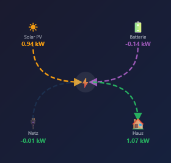
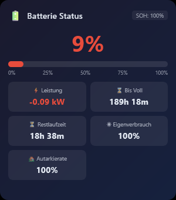
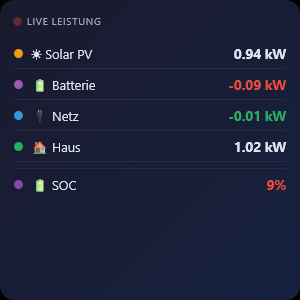

# ioBroker.vis-2-widgets-sigenergy

**Тесты:** 

## Адаптер vis-2-widgets-sigenergy для ioBroker

Набор виджетов VIS-2 для адаптера накопителя энергии Sigenergy (`ioBroker.sigenergy`).
Содержит 8 виджетов для визуализации и управления потоком энергии, состоянием батареи, мощностью в реальном времени, дневной статистикой, зарядным устройством AC, зарядным устройством DC, инвертором и обзором микроинверторов SigenMicro. для визуализации и управления потоком энергии, состоянием аккумулятора, мощностью в реальном времени, дневной статистикой, AC-зарядным устройством, DC-зарядным устройством и инвертором.

## Требования

- ioBroker с установленным и настроенным адаптером `sigenergy`
- Адаптер ioBroker VIS-2 (≥ 2.0.0)

## Виджеты

### Диаграмма потока энергии
Отображает текущий поток энергии между солнечными панелями, аккумулятором, сетью и домом в виде анимированной SVG-диаграммы. Анимированные стрелки визуализируют активные соединения в реальном времени.

**OID:** `pvPower`, `essPower`, `gridActivePower`, `housePower`, `essSoc`

#### Направления потока

| Точка данных | Значение > 0 | Значение < 0 |
|---|---|---|
| `essPower` | Аккумулятор заряжается → стрелка от центра к аккумулятору | Аккумулятор разряжается → стрелка от аккумулятора к центру |
| `gridActivePower` | Потребление из сети → стрелка от сети к центру | Отдача в сеть → стрелка от центра к сети |
| `pvPower` | PV вырабатывает → стрелка от PV к центру | — |
| `housePower` | Дом потребляет → стрелка от центра к дому | — |

### Состояние аккумулятора и прогнозы
Отображает SOC, SOH, мощность зарядки, а также прогнозы времени до полной зарядки, оставшегося времени работы, собственного потребления и уровня автономии.

**OID:** `essSoc`, `essSoh`, `essPower`, `batteryTimeToFull`, `batteryTimeRemaining`, `selfConsumptionRate`, `autarkyRate`

### Мощность в реальном времени
Компактный список всех текущих значений мощности с цветовой индикацией направления.

**OID:** `pvPower`, `essPower`, `gridActivePower`, `housePower`, `essSoc`

### Статистика энергии
Дневной обзор с уровнем автономии, собственным потреблением, изменением SOC, энергией заряда/разряда и покрытием аккумулятора.

**OID:** `autarkyRate`, `selfConsumptionRate`, `dayMaxSoc`, `dayMinSoc`, `essDailyChargeEnergy`, `essDailyDischargeEnergy`, `batteryCoverageToday`, `batteryDailyChargeTime`

### AC-зарядное устройство (Sigen EVAC)
Мониторинг и управление AC-зарядным устройством Sigenergy (EVAC). Отображает мощность зарядки, состояние системы, номинальную мощность, номинальный ток и общее потребление энергии. Аварийные сигналы выделяются цветом. Ток зарядки можно регулировать с помощью ползунка (6–32 А).

**OID:** `acCharger.systemState`, `acCharger.chargingPower`, `acCharger.totalEnergyConsumed`, `acCharger.ratedPower`, `acCharger.ratedCurrent`, `acCharger.alarm1/2/3`, `acCharger.control.startStop`, `acCharger.control.outputCurrent`

### DC-зарядное устройство
Мониторинг и управление DC-зарядным устройством Sigenergy. Отображает выходную мощность, SOC автомобиля с индикатором прогресса, напряжение аккумулятора автомобиля, ток зарядки, а также энергию и продолжительность текущей сессии зарядки.

**OID:** `dcCharger.outputPower`, `dcCharger.vehicleSoc`, `dcCharger.vehicleBatteryVoltage`, `dcCharger.chargingCurrent`, `dcCharger.currentChargingCapacity`, `dcCharger.currentChargingDuration`, `dcCharger.control.startStop`

### Инвертор
Комплексный мониторинг и управление инвертором с навигацией по вкладкам. Отображает рабочее состояние, данные мощности, температуры аккумулятора, фазные напряжения, все 5 регистров аварийных сигналов и информацию об устройстве (модель, серийный номер, прошивка).

| Вкладка | Содержание |
|---|---|
| **Мощность** | Активная мощность, мощность PV, мощность заряда/разряда аккумулятора, ползунок доли мощности (от −100 % до +100 %) |
| **Аккумулятор** | SOC и SOH с индикаторами, средняя температура/напряжение ячеек, макс./мин. температура |
| **Сеть** | Фазные напряжения L1/L2/L3, частота сети, коэффициент мощности, внутренняя температура PCS |
| **Аварии** | 5 регистров аварийных сигналов (PCS ×2, ESS, шлюз, DC-зарядное) с HEX-кодом и цветовой маркировкой |
| **Инфо** | Тип модели, серийный номер, версия прошивки, переключатель Remote-EMS |

**OID:** `inverter.activePower`, `inverter.pvPower`, `inverter.essChargeDischargePower`, `inverter.runningState`, `inverter.essBatterySoc/Soh`, `inverter.essAvgCellTemperature/Voltage`, `inverter.phaseA/B/CVoltage`, `inverter.gridFrequency`, `inverter.pcsInternalTemp`, `inverter.alarm1–5`, `inverter.firmwareVersion`, `inverter.modelType`, `inverter.serialNumber`, `inverter.control.startStop`, `inverter.control.remoteEmsDispatchEnable`, `inverter.control.activePowerPercent`

### PV Power
Отображение до 3 PV-строк с актуальными значениями мощности и анимированными стрелками потока к гибридному инвертору. Цвета стрелок изменяются динамически в зависимости от мощности (оранжевый <1 кВт, жёлтый <2 кВт, зелёный >2 кВт).

#### Настройки виджета
| Параметр | Тип | По умолчанию | Описание |
|---|---|---|---|
| oid_pv1 … oid_pv3 | OID | sigenergy.0.plant.pv1Power … pv3Power | OID мощности PV-строк |
| oid_pvtotal | OID | sigenergy.0.plant.pvPower | OID общей мощности PV |
| sig_title | текст | PV Power | Заголовок виджета |
| sig_name1 … sig_name3 | текст | String 1 … String 3 | Настраиваемые имена строк |
| sig_darkmode | флажок | true | Тёмный / светлый режим |

**OIDs:** `plant.pv1Power`, `plant.pv2Power`, `plant.pv3Power`, `plant.pvPower`

### Обзор SigenMicro
Обзор и детальное представление всех микроинверторов SigenMicro на шине Modbus. Вкладка 1 показывает все устройства в виде анимированного сетевого сегмента (топология Ethernet-шины с вертикальными ответвлениями). Каждая последующая вкладка отображает все 15 регистров соответствующего устройства в возрастающем порядке.

#### Динамический макет
| Устройства | Строки | Размер изображения |
|---|---|---|
| 1–5 | 1 строка | 80 × 90 пкс |
| 6–10 | 1 строка | 52 × 60 пкс |
| 11–15 | 2 строки | 46 × 52 пкс |
| 16–20 | 2 строки | 40 × 46 пкс |

## Оформление

Все виджеты поддерживают **светлый и тёмный режим**, переключаемый через настройку виджета `Тёмный режим`.

## Changelog
### 1.7.0 (2026-04-17)
* (ssbingo) Виджет 9: добавлен PV Power с отображением 3 PV-строк и анимированными стрелками потока

### 1.6.7 (2026-04-09)
* (ssbingo) Исправлен синтаксис cooldown в dependabot.yml (default-days вместо default)

### 1.6.6 (2026-04-09)
* (ssbingo) Старые записи changelog перенесены в CHANGELOG_OLD.md; добавлен cooldown для Dependabot (7 дней)

### 1.6.5 (2026-04-09)
* (ssbingo) Удалён job adapter-tests из workflow (неприменимо для VIS widget-адаптера); deploy теперь использует Node.js 24

### 1.6.4 (2026-03-26)
* (ssbingo) test:integration восстановлен как no-op (требуется testing-action-adapter; нет Node.js-процесса в mode:none widget-адаптере)

### 1.6.3 (2026-03-26)
* (ssbingo) Синхронизированы все языковые README с пропущенными записями changelog (1.5.10–1.6.2)

### 1.6.2 (2026-03-26)
* (ssbingo) Интеграционный тест удалён — неприменимо для widget-адаптера с mode:none (нет Node.js-процесса)

### 1.6.1 (2026-03-26)
* (ssbingo) Удалена настройка ESLint/Prettier — нет Node.js-кода для проверки в чистом виджет-адаптере; шаг lint удалён из workflow

### 1.6.0 (2026-03-26)
* (ssbingo) Тестирование завершено

### 1.5.11 (2026-03-26)
* (ssbingo) Workflow: install-command установлен на npm install (требуется регенерация lock-файла после добавления @iobroker/eslint-config)

### 1.5.10 (2026-03-26)
* (ssbingo) README.md: раздел LICENSE перемещён в конец (после CHANGELOG), полный текст лицензии MIT

### 1.5.8 (2026-03-18)
* (ssbingo) fixed GitHub-Actions (PR)

### 1.5.7 (2026-03-18)
* (ssbingo) Раздел '## Установка' удалён из всех файлов README (S6014)

### 1.5.6 (2026-03-18)
* (ssbingo) Повышение версии до 1.5.6; функциональных изменений нет

### 1.5.5 (2026-03-18)
* (ssbingo) Повышение версии: 1.5.4 уже опубликована на npm; функциональных изменений нет

### 1.5.4 (2026-03-18)
* (ssbingo) Добавлен npm-token в рабочий процесс test-and-release для автоматической публикации npm

### 1.5.3 (2026-03-17)
* (ssbingo) Удалены примеры шагов установки из всех файлов README
* (ssbingo) Исправлена ошибка E1111: удалён пример конфигурации native (option1/option2) из io-package.json

### 1.5.2 (2026-03-17)
* (ssbingo) Добавлены скриншоты виджетов: обзор SigenMicro
* (ssbingo) Скриншот потока энергии обновлён

### 1.5.1 (2026-03-17)
* (ssbingo) Bugfix: Widget 8 code placed correctly inside vis.binds object — all widgets visible again

### 1.5.0 (2026-03-17)
* (ssbingo) Виджет 8: обзор SigenMicro с анимированной топологией шины Ethernet
* (ssbingo) Динамический макет для 1–20 микроинверторов, 4 уровня размеров, 1–2 строки
* (ssbingo) Вкладка деталей для каждого устройства со всеми 15 регистрами Modbus (01–15)

### 1.4.4 (2026-03-12)
* Виджет потока энергии: метка SOC и значение сдвинуты на 5px вверх

### 1.3.2 (2026-03-12)
* Документация добавлена в README.md — многоязычная (RU, NL, FR)

### 1.3.1 (2026-03-12)
* Добавлена немецкая документация в doc/de/README.md; README: добавлен раздел документации со ссылками

### 1.3.0 (2026-03-12)
* Виджет потока энергии: анимация сети разделена на два отдельных пути (потребление/отдача)
* Виджет потока энергии: auto-start-reverse полностью удалён — все направления через отдельные пути

### 1.2.9 (2026-03-12)
* Виджет потока энергии: точка привязки пути аккумулятора y=75 → y=71

### 1.2.8 (2026-03-12)
* Виджет потока энергии: стрелка аккумулятора при зарядке расположена под цифрами
* Виджет потока энергии: размер шрифта значений увеличен с 10.5 до 12.5

### 1.2.7 (2026-03-12)
* Виджет потока энергии: направление аккумулятора полностью переработано — два отдельных пути (заряд/разряд) заменяют некорректный auto-start-reverse

### 1.2.6 (2026-03-12)
* Виджет потока энергии: анимация и стрелка сети инвертированы
* Виджет потока энергии: анимация и стрелка аккумулятора инвертированы

### 1.2.5 (2026-03-12)
* Виджет потока энергии: направление стрелки аккумулятора инвертировано

### 1.2.4 (2026-03-11)
* `common.mode` изменён на `none`

### 1.2.3 (2026-03-11)
* `common.mode` изменён на `once`

### 1.2.2 (2026-03-11)
* Исправления

### 1.2.1 (2026-03-11)
* Исправление README.md

### 1.2.0 (2026-03-11)
* README: добавлены скриншоты всех 7 виджетов
* Папка `img/` со скриншотами добавлена в package.json files

### 1.1.9 (2026-03-11)
* Виджет потока энергии: исправлен наконечник стрелки аккумулятора

### 1.1.8 (2026-03-11)
* Виджет потока энергии: исправлено направление стрелки аккумулятора

### 1.1.7 (2026-03-10)
* Исправлен W1084: удалён устаревший `common.title`

### 1.1.6 (2026-03-10)
* Добавлен `title` в io-package.json

### 1.1.5 (2026-03-10)
* `vis` добавлен в `restartAdapters` в io-package.json

### 1.1.4 (2026-03-10)
* Исправлен W1068: `ioBroker` удалён из keywords

### 1.1.3 (2026-03-10)
* Ключевое слово `ioBroker` добавлено в io-package.json

### 1.1.2 (2026-03-10)
* `admin/` добавлен в поле `files` package.json — иконка устанавливается корректно

### 1.1.1 (2026-03-10)
* Исправлен E1012: `icon` = имя файла, `extIcon` = GitHub Raw URL

### 1.1.0 (2026-03-10)
* Иконка встроена как Base64-Data-URI в io-package.json

### 1.0.9 (2026-03-10)
* Разрешение иконки исправлено до 512×512 пикселей

### 1.0.8 (2026-03-10)
* `extIcon` исправлен на GitHub Raw URL (E1012)

### 1.0.7 (2026-03-10)
* Исправлено подключение иконки

### 1.0.6 (2026-03-10)
* Логотип Sigenergy добавлен как иконка адаптера

### 1.0.5 (2026-03-09)
* Исправления
### 1.0.4 (2026-03-09)
* Исправления
### 1.0.3 (2026-03-09)
* Исправления
### 1.0.2 (2026-03-09)
* Исправления
### 1.0.1 (2026-03-09)
* (ssbingo) 4 виджета созданы в формате VIS-2
* (ssbingo) Диаграмма потока энергии с SVG-анимациями
* (ssbingo) Виджет состояния аккумулятора и прогнозов
* (ssbingo) Виджет мощности в реальном времени
* (ssbingo) Виджет статистики энергии

## Лицензия
MIT License

Copyright (c) 2026 ssbingo <s.sternitzke@online.de>

Данная лицензия разрешает лицам, получившим копию данного программного обеспечения
и сопутствующей документации, безвозмездно использовать программное обеспечение
без ограничений, включая неограниченное право на использование, копирование,
изменение, слияние, публикацию, распространение, сублицензирование и/или продажу
копий программного обеспечения, а также лицам, которым предоставляется данное
программное обеспечение, при соблюдении следующих условий:

Указанное выше уведомление об авторском праве и данное разрешение должны быть
включены во все копии или значительные части данного программного обеспечения.

ДАННОЕ ПРОГРАММНОЕ ОБЕСПЕЧЕНИЕ ПРЕДОСТАВЛЯЕТСЯ «КАК ЕСТЬ», БЕЗ КАКИХ-ЛИБО ГАРАНТИЙ,
ЯВНЫХ ИЛИ ПОДРАЗУМЕВАЕМЫХ, ВКЛЮЧАЯ, НО НЕ ОГРАНИЧИВАЯСЬ ГАРАНТИЯМИ ТОВАРНОЙ ПРИГОДНОСТИ,
СООТВЕТСТВИЯ ПО ЕГО КОНКРЕТНОМУ НАЗНАЧЕНИЮ И НЕНАРУШЕНИЯ ПРАВ.

## Документация

- 🇷🇺 [Русский](../../doc/ru/README.md) — этот файл
- 🇩🇪 [Deutsch](../../doc/de/README.md)
- 🇬🇧 [English](../../README.md)
- 🇳🇱 [Nederlands](../../doc/nl/README.md)
- 🇫🇷 [Français](../../doc/fr/README.md)
- 🇮🇹 [Italiano](../../doc/it/README.md)
- 🇪🇸 [Español](../../doc/es/README.md)
- 🇵🇱 [Polski](../../doc/pl/README.md)
- 🇵🇹 [Português](../../doc/pt/README.md)
